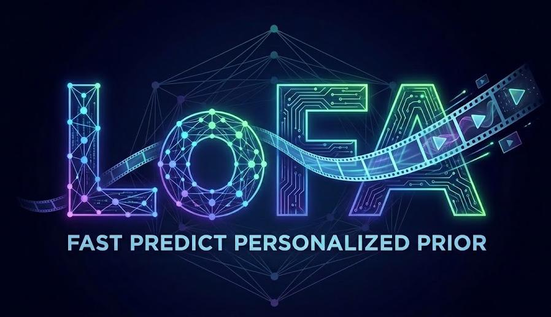

# **LoFA: Learning to Predict Personalized Priors for Fast Adaptation of Visual Generative Models**

<sub>Official PyTorch Implementation</sub>

---

<div align="center">


<br>
<a href="https://arxiv.org/abs/2512.08785" target="_blank">
    
</a>
<a href="https://jaeger416.github.io/lofa/" target="_blank">
    
</a>
<a href="https://huggingface.co/ymhao/LoFA_v0" target="_blank">
  
</a>
<br>

***[Yiming Hao<sup>1*</sup>](https://scholar.google.com/citations?user=mlu1Oo4AAAAJ&hl=en), [Mutian Xu<sup>1*</sup>](https://mutianxu.github.io/), [Chongjie Ye<sup>2,3,1</sup>](https://github.com/hugoycj), [Jie Qin<sup>1</sup>](#), [Shunlin Lu<sup>2</sup>](https://shunlinlu.github.io/), [Yipeng Qin<sup>5</sup>](https://yipengqin.github.io/), [Xiaoguang Han<sup>1,2,3†</sup>](https://gaplab.cuhk.edu.cn/pages/people)***  
<small>*equal contribution; †project lead</small>  
<sup>1</sup>SSE, CUHKSZ  <sup>2</sup>FNii-Shenzhen 

<sup>3</sup>Guangdong Provincial Key Laboratory of Future Networks of Intelligence, CUHKSZ

<sup>4</sup>SDS, CUHKSZ <sup>5</sup>Cardiff University 

</div>

---
## 🔥 News
- **[2025.2.1]** 📄✨ Training and inferencing code is now available. A preview model now can be downloaded from  [huggingface](https://huggingface.co/ymhao/LoFA_v0).

- **[2025.12.19]** 📄✨ The paper is officially released,**training and inference pipelines** will be released soon this month.


## 🧠 Overview

We introduce **LoFA**, a general framework that predicts personalized priors (i.e., LoRA weights) <span style="color:red;">**within seconds**</span> for fast adaptation of visual generative models and achieves performance <span style="color:blue;">**comparable to, and even exceeding**</span>, conventional LoRA training.

## 💪 Get Started
### Installation
Clone the repo:
```bash
git clone https://github.com/GAP-LAB-CUHK-SZ/LoFA.git
cd LoFA
```

Create a conda environment:
```bash
conda create -n LoFA python=3.10
conda activate LoFA
```

Install dependencies:
```bash
# pytorch (select correct CUDA version)
pip install torch==2.5.1 torchvision==0.20.1 --index-url https://download.pytorch.org/whl/{your-cuda-version}
pip install flash-attn==0.28.3 xformers==0.0.27.post2
# install LoFA
pip install -r requirements.txt
pip install -e .
# install diffsyn-studio
cd src
pip install -r requirements.txt
pip install -e .
```

For training and inferencing, you need to download pretrained WAN2.1-1.3B-T2V model following [DiffSynth-Studio
](https://github.com/modelscope/DiffSynth-Studio)
### 🚀 Training 


```bash
# training stage-I
accelerate launch --config_file accelerator/node.yaml launch.py --mode recon --config stage1
# training stage-II
accelerate launch --config_file accelerator/node.yaml launch.py --mode diff --config stage2
```

### 💫 Inference   
You can download the checkpoint from [here](https://huggingface.co/ymhao/LoFA_v0) or train the model by yourself.

```bash
# get response prior
python demo_stage1.py
# inference videos
python demo_stage2.py
```

Notes:
+ Current models is a preview version and only trained on MotionX videos for validating the methology and has limited generalization. Thus the [prompts of MotionX](https://huggingface.co/ymhao/LoFA_v0) is provided and recommanded.
+ We are training a new version based on large-scale web videos.

## TODO
- [√] 🧪 Release **inference pipeline**  
- [√] 📦 Provide **pretrained LoFA checkpoints**  
  - [√] Text Conditioned Human Action Video Generation
  - [ ] Pose Conditioned Human Action Video Generation
  - [ ] Text-to-Video Stylization
  - [ ] Identity-Personalized Image Generation
- [√] 🚀 Release **Training pipeline**  
- [√] 🧩 Add **custom dataset support**  
- [√] 📊 Release **evaluation scripts**  


## 📄 Citation

If you use this work in your research, please cite our paper:

```bibtex
@InProceedings{Hao_2026_CVPR,
    author    = {Hao, Yiming and Xu, Mutian and Ye, Chongjie and Qin, Jie and Lu, Shunlin and Qin, Yipeng and Han, Xiaoguang},
    title     = {LoFA: Learning to Predict Personalized Prior for Fast Adaptation of Visual Generative Models},
    booktitle = {Proceedings of the IEEE/CVF Conference on Computer Vision and Pattern Recognition (CVPR)},
    month     = {June},
    year      = {2026},
    pages     = {21986-21996}
}
```
---

## 📧 Contact

For questions and issues, please open an issue on GitHub or contact the [author](haoym1016@gmail.com).

---

<div align="center">
<sub>Made with ❤️ by the GAP LAB</sub>
</div>